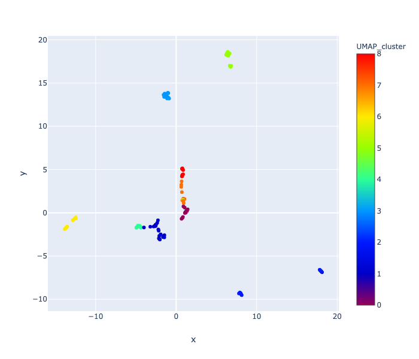
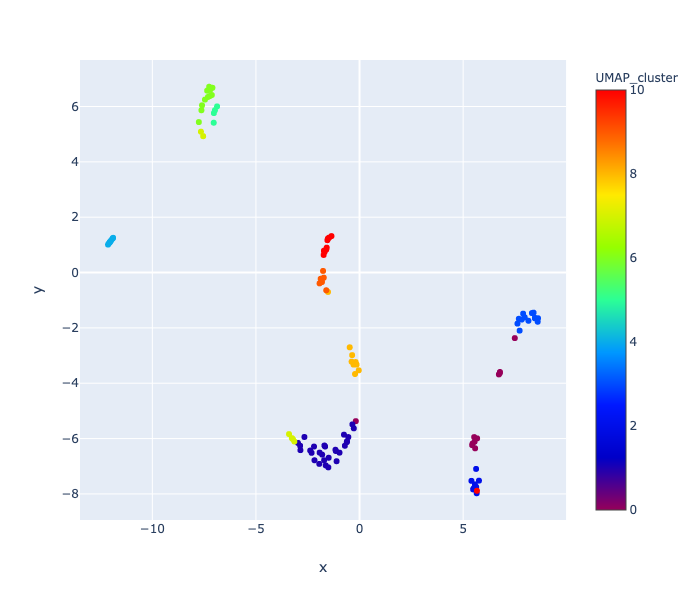

# cs325_guiviz
Capstone Project CS325 - Building an interface for visualization and exploration of reflective medical writing.

## Requirements
Python 3.6 or higher.  Results below were generated with Python 3.7.3.

Required Python Packages:

 * argparse
 * os
 * nltk
 * re
 * string
 * math
 * datetime
 * sklearn
 * gensim
 * numpy
 * scipy
 * pandas
 * logging
 * matplotlib
 * textblob
 * plotly
 * umap-learn
 

## USAGE

__*usage:*__ discover_topics_UMAP_Kmeans.py [-h] -i inputfile -c tfidfcorpus\
                                      [-v wordVectorType] [-b w2vBinFile]\
                                      [-o outputdir] [-p prefix]\
                                      [-w windowSize] [-g goldStandard]\
                                      [-t threshold] [-d dimensions]\
                                      [-s scatter-plot] [-u umap-neighbors]\
                                      [-m distmetric]\
                                      [--include_input_in_tfidf]\
                                      [--output_labeled_sentences]\
                                      [--use_kmeans]\

Parse a directory of files to identify top sentence phrases and cluster them
to create topic clusters.

__*arguments:*__

__*-h, --help* __           show this help message and exit 

__*-i inputfile* __         Path and name of input file list, listing the document
                        names to process. One text file per document in .txt
                        format is required.
                        
__*-c tfidfcorpus*__        Path and name of file containing a list of documents
                        to use for creating the TF-IDF matrix. One text file
                        per document in .txt format is required.
                        
__*-v wordVectorType*__     The type of word vector to use. Options are tfidf,
                        svd, umap, pretrained, local.
                        
__*-b w2vBinFile*__         The location and name of the pre-trained word2vec bin
                        file.
                        
__*-o outputdir*__          Path to the output directory where results should be
                        saved., Default is current working directory.
                        
__*-p prefix*__             The unique output file name prefix to uniquely
                        identify files.
                        
__*-w windowSize*__         An integer representing the window size for sentence
                        phrases feature extraction. Default is 6.
                        
__*-g goldStandard*__       The path and file name of the gold standard file for
                        the analyzed corpus.
                        
__*-t threshold*__          The threshold to use for cutting the dendrogram to
                        make clusters.
                        
__*-d dimensions*__         The number of dimentions to reduce the TF-IDF or
                        WordVec to.
                        
__*-s scatter-plot*__       The scatter plots you would like output. Valid values
                        are umap, svd, mds, all. Default = umap
                        
__*-u umap-neighbors*__     The number of neighbors to use for UMAP dimension
                        reduction. Default = 15
                        
__*-m distmetric*__         The distance metric to use for HAC clustering. Can be
                        any accepted by pdist: ‘braycurtis’, ‘canberra’,
                        ‘chebyshev’, ‘cityblock’, ‘correlation’, ‘cosine’,
                        ‘dice’, ‘euclidean’, ‘hamming’, ‘jaccard’,
                        ‘kulsinski’, ‘mahalanobis’, ‘matching’, ‘minkowski’,
                        ‘rogerstanimoto’, ‘russellrao’, ‘seuclidean’,
                        ‘sokalmichener’, ‘sokalsneath’, ‘sqeuclidean’, ‘yule’.
                        
__*--include_input_in_tfidf*__    Whether or not the input corpus should be included in
                              the tf-idf matrix. If no then the average score across
                              all documents is used for a words significance when
                              generating phrases.
                        
__*--output_labeled_sentences*__  Specify if you want the labeled sentence file saved.
                        
__*--use_kmeans*__                Specify if you want Kmeans to be run as the clustering
                              algorithm. You will be asked to input the number of
                              clusters dynamically after elbow plot generation. The
                              default clustering algorithm is hierarchical
                              agglomerative clustering. By using Kmeans, the
                              distance metric is required to be Euclidean Distance,
                              and any other distance metric specification will be
                              ignored.

### Usage Examples
Results obtained using Python 3.7.3.  If your version is different, then you may get different results.  I have not determined why or what method is causing this issue.

#### Example 1: Using SVD reduction and TF-IDF for word vectors.
Local TF-IDF using SVD sklearn implementation reduced to 10 dimensions.

##### Command Line: 
\>> python discover_topics_UMAP_Kmeans.py \
      -i 2019.02.12_ChallengePrompt_March2017/FILELIST_2019.02.12_ChallengePrompt_March2017.txt \
      -c 2019.03.12_SEED_TOPICS_AMY/FILELIST.txt \
      -g 2019.02.12_ChallengePrompt_March2017/GOLD_Expert_2019.03.12_TestCorpus_AMY.txt \
      -o ./results \
      --include_input_in_tfidf \
      -v svd \
      -w 6 \
      -p TODAY2_UMAP_TESTING_LocalTFIDF_SVD_w6_d10 \
      -t 8 \
      -d 10 \
      -u 15 \
      -m cosine

##### Results:
Number of Documents Loaded: 22

Size of TF-IDF: 26 Docs, 1000 Tokens

Calculating SVD transform of TF-IDF...

Threshold specified, skipping silhouette analysis...

Total Number of Sentences: 155

Number of Clustered Sentences:115

Number of Clusters: 9

outfile: ./results/SVD_results_d10_TopicClusterResults_svd.txt

`----------------------------------------------------------------------`\
`Gold Concept             ClosestC  TP  FP  FN    P       R       F1   `\
`----------------------------------------------------------------------`\
`Confidence                  0      4   1   14   0.8    0.222   0.348  `\
`Overwhelmed                 2      2   4   2   0.333    0.5     0.4   `\
`Supportive Environment      6      3   4   10  0.429   0.231    0.3   `\
`System Issues               7      2   1   0   0.667    1.0     0.8   `\
`----------------------------------------------------------------------`\

#### Example 2: Using UMAP reduction and TF-IDF for word vectors.
Local TF-IDF using UMAP reduction to 10 dims

##### Command: 
\>> python discover_topics_UMAP_Kmeans.py \
      -i 2019.02.12_ChallengePrompt_March2017/FILELIST_2019.02.12_ChallengePrompt_March2017.txt \
      -c 2019.03.12_SEED_TOPICS_AMY/FILELIST.txt \
      -g 2019.02.12_ChallengePrompt_March2017/GOLD_Expert_2019.03.12_TestCorpus_AMY.txt \
      -o ./results \
      --include_input_in_tfidf \
      -v umap \
      -w 6 \
      -p TODAY2_UMAP_TESTING_LocalTFIDF_UMAP_w6_d10 \
      -t 8 \
      -d 10 \
      -u 10 \
      -m cosine

##### Results:
Number of Documents Loaded: 22

Size of TF-IDF: 26 Docs, 1000 Tokens

Calculating UMAP transform of TF-IDF...

Threshold specified, skipping silhouette analysis...

Total Number of Sentences: 155

Number of Clustered Sentences:115

Number of Clusters: 11

outfile: ./results/UMAP_results_d10_TopicClusterResults_umap.txt

`----------------------------------------------------------------------`\
`Gold Concept             ClosestC  TP  FP  FN    P       R       F1   `\
`----------------------------------------------------------------------`\
`Confidence                  8      4   1   14   0.8    0.222   0.348  `\
`Overwhelmed                 2      1   2   3   0.333    0.25   0.286  `\
`Supportive Environment      1      5   2   8   0.714   0.385    0.5   `\
`System Issues               7      2   0   0    1.0     1.0     1.0   `\
`----------------------------------------------------------------------`\

